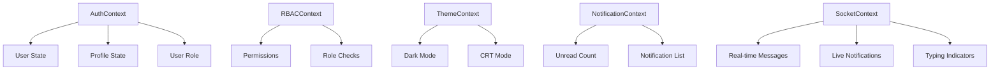

# Design Document: LINKER UI/UX Overhaul

## Overview

This design document outlines the comprehensive UI/UX overhaul for the LINKER platform. The goal is to transform the current beta into a production-ready, professional, modern, and fully functional social platform while maintaining the unique retro/newspaper aesthetic. The overhaul covers all major pages, introduces RBAC for 4 user types, and implements production-grade features including error handling, crash recovery, real-time messaging, and comprehensive user features.

### Design Principles

1. **Retro-Modern Fusion**: Maintain the newspaper/neo-brutalist aesthetic while ensuring modern usability
2. **Mobile-First**: Design for mobile devices first, then enhance for desktop
3. **Accessibility**: Ensure WCAG 2.1 AA compliance with proper contrast and touch targets
4. **Performance**: Optimize for fast loading with skeleton states and lazy loading
5. **Consistency**: Use a unified design system across all pages
6. **Production-Grade**: Implement proper error boundaries, crash recovery, logging, and monitoring
7. **Security-First**: Implement proper authentication, authorization, input validation, and XSS prevention
8. **Scalability**: Design for horizontal scaling with proper caching and database optimization

## Architecture

### Frontend Architecture

```
apps/web/
├── app/
│   ├── components/
│   │   ├── ui/                    # Base UI components
│   │   │   ├── NewspaperUI.tsx    # Core retro components
│   │   │   ├── BottomNav.tsx      # Mobile bottom navigation
│   │   │   ├── Skeleton.tsx       # Loading skeletons (NEW)
│   │   │   ├── SocialIcons.tsx    # Social media icons (NEW)
│   │   │   └── AnimatedComponents.tsx # Framer Motion wrappers (NEW)
│   │   ├── dashboard/             # Dashboard-specific components
│   │   │   ├── ProfileSidebar.tsx # User profile card
│   │   │   ├── ToolsSidebar.tsx   # Quick actions
│   │   │   └── FeedCard.tsx       # Post card component
│   │   ├── feed/                  # Feed components
│   │   │   ├── PostCard.tsx       # Individual post
│   │   │   ├── PostActions.tsx    # Like/Comment/Save/Share (NEW)
│   │   │   └── FeedComposer.tsx   # Create post
│   │   ├── admin/                 # Admin components (NEW)
│   │   │   ├── AdminDashboard.tsx # Platform admin dashboard
│   │   │   ├── CollegeAdmin.tsx   # College admin panel
│   │   │   ├── ClubAdmin.tsx      # Club management panel
│   │   │   └── ModerationQueue.tsx # Content moderation
│   │   └── navigation/            # Navigation components
│   │       ├── Navbar.tsx         # Top navigation
│   │       ├── ArcMenu.tsx        # Mobile radial menu
│   │       └── CategoryRibbon.tsx # Category tabs
│   ├── context/
│   │   ├── AuthContext.tsx        # Authentication state
│   │   ├── ThemeContext.tsx       # Dark/Light mode (NEW)
│   │   ├── NotificationContext.tsx # Notifications (NEW)
│   │   └── RBACContext.tsx        # Role-based permissions (NEW)
│   ├── hooks/
│   │   ├── useTheme.ts            # Theme management (NEW)
│   │   ├── useNotifications.ts    # Notification handling (NEW)
│   │   ├── usePermissions.ts      # RBAC permission checks (NEW)
│   │   └── useErrorBoundary.ts    # Error handling (NEW)
│   └── lib/
│       ├── api.ts                 # API client with error handling
│       ├── errorReporting.ts      # Error logging service (NEW)
│       └── animations.ts          # Framer Motion variants (NEW)
```

### Backend Architecture (Production-Grade)

```
apps/server/
├── src/
│   ├── modules/
│   │   ├── auth/                  # Authentication & Authorization
│   │   │   ├── guards/
│   │   │   │   ├── jwt-auth.guard.ts
│   │   │   │   └── roles.guard.ts      # RBAC guard (NEW)
│   │   │   ├── decorators/
│   │   │   │   └── roles.decorator.ts  # Role decorator (NEW)
│   │   │   └── strategies/
│   │   ├── users/                 # User management
│   │   ├── notifications/         # Real-time notifications (NEW)
│   │   │   ├── notifications.gateway.ts
│   │   │   ├── notifications.service.ts
│   │   │   └── notifications.controller.ts
│   │   ├── admin/                 # Admin functionality (NEW)
│   │   │   ├── admin.controller.ts
│   │   │   ├── admin.service.ts
│   │   │   └── admin.module.ts
│   │   ├── certificates/          # Certificate generation (NEW)
│   │   │   ├── certificates.service.ts
│   │   │   └── templates/
│   │   └── moderation/            # Content moderation (NEW)
│   │       ├── moderation.service.ts
│   │       └── moderation.controller.ts
│   ├── common/
│   │   ├── filters/
│   │   │   ├── all-exceptions.filter.ts  # Global error handling
│   │   │   └── http-exception.filter.ts
│   │   ├── interceptors/
│   │   │   ├── logging.interceptor.ts    # Request logging (NEW)
│   │   │   └── timeout.interceptor.ts    # Request timeout (NEW)
│   │   └── middleware/
│   │       ├── rate-limit.middleware.ts  # Rate limiting (NEW)
│   │       └── sanitize.middleware.ts    # Input sanitization (NEW)
│   └── prisma/
│       └── prisma.service.ts      # Database with connection pooling
```

### State Management



### RBAC Permission Matrix

| Feature | Student | Club Admin | College Admin | Platform Admin |
|---------|---------|------------|---------------|----------------|
| View Feed | ✓ | ✓ | ✓ | ✓ |
| Create Posts | ✓ | ✓ | ✓ | ✓ |
| Create Anonymous Posts | ✓ | ✓ | ✓ | ✓ |
| Join Clubs | ✓ | ✓ | ✓ | ✓ |
| RSVP Events | ✓ | ✓ | ✓ | ✓ |
| Create Marketplace Listings | ✓ | ✓ | ✓ | ✓ |
| Upload Notes | ✓ | ✓ | ✓ | ✓ |
| Suggest Events | ✓ | ✓ | ✓ | ✓ |
| Edit Club Profile | ✗ | Own Club | ✓ | ✓ |
| Manage Club Members | ✗ | Own Club | ✓ | ✓ |
| Create Club Events | ✗ | Own Club | ✓ | ✓ |
| Generate Certificates | ✗ | Own Club | ✓ | ✓ |
| Approve Events | ✗ | ✗ | Own College | ✓ |
| Moderate Feed | ✗ | ✗ | Own College | ✓ |
| Edit College Info | ✗ | ✗ | Own College | ✓ |
| Create Clubs | ✗ | ✗ | Own College | ✓ |
| Manage All Colleges | ✗ | ✗ | ✗ | ✓ |
| Global Bans | ✗ | ✗ | ✗ | ✓ |
| Platform Config | ✗ | ✗ | ✗ | ✓ |
| View Analytics | ✗ | Club Stats | College Stats | All Stats |

## Components and Interfaces

### 1. RBAC System

```typescript
// User Roles Enum
enum UserRole {
  STUDENT = 'STUDENT',
  CLUB_ADMIN = 'CLUB_ADMIN',
  COLLEGE_ADMIN = 'COLLEGE_ADMIN',
  PLATFORM_ADMIN = 'PLATFORM_ADMIN'
}

// RBAC Context Interface
interface RBACContextType {
  role: UserRole;
  permissions: Permission[];
  hasPermission: (permission: Permission) => boolean;
  canManageClub: (clubId: string) => boolean;
  canManageCollege: (collegeId: string) => boolean;
  isAdmin: () => boolean;
}

// Permission Types
type Permission = 
  | 'create:post'
  | 'create:event'
  | 'manage:club'
  | 'manage:college'
  | 'moderate:content'
  | 'manage:users'
  | 'view:analytics'
  | 'configure:platform';

// Backend Role Guard
@Injectable()
export class RolesGuard implements CanActivate {
  constructor(private reflector: Reflector) {}
  
  canActivate(context: ExecutionContext): boolean {
    const requiredRoles = this.reflector.getAllAndOverride<UserRole[]>('roles', [
      context.getHandler(),
      context.getClass(),
    ]);
    if (!requiredRoles) return true;
    const { user } = context.switchToHttp().getRequest();
    return requiredRoles.some((role) => user.role === role);
  }
}
```

### 2. Theme System

```typescript
// ThemeContext Interface
interface ThemeContextType {
  isDarkMode: boolean;
  isCRTMode: boolean;
  toggleDarkMode: () => void;
  toggleCRTMode: () => void;
}

// CSS Variables for themes
interface ThemeVariables {
  '--ink': string;
  '--paper': string;
  '--accent-yellow': string;
  '--accent-blue': string;
  '--accent-pink': string;
}
```

### 2. Notification System

```typescript
interface Notification {
  id: string;
  type: 'like' | 'comment' | 'follow' | 'event' | 'message';
  title: string;
  message: string;
  read: boolean;
  createdAt: Date;
  actionUrl: string;
  actor?: {
    id: string;
    name: string;
    avatarUrl?: string;
  };
}

interface NotificationContextType {
  notifications: Notification[];
  unreadCount: number;
  markAsRead: (id: string) => void;
  markAllAsRead: () => void;
  fetchNotifications: () => Promise<void>;
}
```

### 3. Post Interactions

```typescript
interface PostActions {
  isLiked: boolean;
  isSaved: boolean;
  likeCount: number;
  commentCount: number;
  shareCount: number;
}

interface PostActionsProps {
  postId: string;
  initialState: PostActions;
  onLike: () => Promise<void>;
  onComment: () => void;
  onSave: () => Promise<void>;
  onShare: () => void;
}
```

### 4. Social Links

```typescript
interface SocialLinks {
  instagram?: string;
  linkedin?: string;
  github?: string;
  discord?: string;
  whatsapp?: string;
  website?: string;
}

interface SocialIconsProps {
  links: SocialLinks;
  size?: 'sm' | 'md' | 'lg';
  showLabels?: boolean;
}
```

### 5. Framer Motion Animation System

```typescript
// Animation variants for consistent animations
import { Variants } from 'framer-motion';

// Page transition variants
export const pageVariants: Variants = {
  initial: { opacity: 0, y: 20 },
  animate: { opacity: 1, y: 0, transition: { duration: 0.4, ease: 'easeOut' } },
  exit: { opacity: 0, y: -20, transition: { duration: 0.3 } }
};

// Staggered list variants
export const containerVariants: Variants = {
  hidden: { opacity: 0 },
  visible: {
    opacity: 1,
    transition: { staggerChildren: 0.1, delayChildren: 0.2 }
  }
};

export const itemVariants: Variants = {
  hidden: { opacity: 0, y: 20, rotate: -2 },
  visible: { 
    opacity: 1, 
    y: 0, 
    rotate: 0,
    transition: { type: 'spring', stiffness: 300, damping: 24 }
  }
};

// Card hover variants
export const cardHoverVariants: Variants = {
  rest: { scale: 1, rotate: 0, boxShadow: '4px 4px 0px 0px rgba(0,0,0,1)' },
  hover: { 
    scale: 1.02, 
    rotate: -1,
    boxShadow: '8px 8px 0px 0px rgba(0,0,0,1)',
    transition: { type: 'spring', stiffness: 400, damping: 17 }
  },
  tap: { scale: 0.98 }
};

// Like button micro-interaction
export const likeVariants: Variants = {
  unliked: { scale: 1 },
  liked: { 
    scale: [1, 1.3, 1],
    transition: { duration: 0.3, times: [0, 0.5, 1] }
  }
};

// Modal variants
export const modalVariants: Variants = {
  hidden: { opacity: 0, scale: 0.9, y: 20 },
  visible: { 
    opacity: 1, 
    scale: 1, 
    y: 0,
    transition: { type: 'spring', stiffness: 300, damping: 25 }
  },
  exit: { opacity: 0, scale: 0.9, y: 20 }
};

// Skeleton shimmer animation
export const shimmerVariants: Variants = {
  animate: {
    backgroundPosition: ['200% 0', '-200% 0'],
    transition: { duration: 1.5, repeat: Infinity, ease: 'linear' }
  }
};
```

### 6. Production Error Handling

```typescript
// Global error boundary with crash recovery
interface ErrorBoundaryState {
  hasError: boolean;
  error: Error | null;
  errorInfo: React.ErrorInfo | null;
}

class ProductionErrorBoundary extends React.Component<Props, ErrorBoundaryState> {
  state: ErrorBoundaryState = { hasError: false, error: null, errorInfo: null };

  static getDerivedStateFromError(error: Error): Partial<ErrorBoundaryState> {
    return { hasError: true, error };
  }

  componentDidCatch(error: Error, errorInfo: React.ErrorInfo) {
    // Log to error reporting service
    errorReportingService.captureException(error, {
      componentStack: errorInfo.componentStack,
      userId: this.props.userId,
      route: window.location.pathname
    });
    
    this.setState({ errorInfo });
  }

  handleRetry = () => {
    this.setState({ hasError: false, error: null, errorInfo: null });
  };

  render() {
    if (this.state.hasError) {
      return <ErrorFallback error={this.state.error} onRetry={this.handleRetry} />;
    }
    return this.props.children;
  }
}

// API error handling with retry logic
async function apiRequest<T>(
  url: string, 
  options: RequestInit,
  retries = 3
): Promise<T> {
  for (let attempt = 0; attempt < retries; attempt++) {
    try {
      const response = await fetch(url, {
        ...options,
        headers: {
          'Content-Type': 'application/json',
          ...options.headers
        }
      });
      
      if (!response.ok) {
        const error = await response.json();
        throw new APIError(response.status, error.message, error.code);
      }
      
      return response.json();
    } catch (error) {
      if (attempt === retries - 1) throw error;
      await new Promise(r => setTimeout(r, Math.pow(2, attempt) * 1000));
    }
  }
  throw new Error('Max retries exceeded');
}
```

## Data Models

### User Model with RBAC

```typescript
interface User {
  id: string;
  email: string;
  role: UserRole;
  profile?: Profile;
  // Admin relationships
  managedClubs?: Club[];      // For CLUB_ADMIN
  managedCollege?: College;   // For COLLEGE_ADMIN
  createdAt: Date;
  updatedAt: Date;
  lastLoginAt?: Date;
  isBanned: boolean;
  banReason?: string;
}
```

### Extended Profile Model

```typescript
interface Profile {
  id: string;
  userId: string;
  fullName: string;
  bio?: string;
  avatarUrl?: string;
  collegeId?: string;
  college?: College;
  interests: string[];
  level: number;
  karma: number;
  // Social Links (NEW)
  instagram?: string;
  linkedin?: string;
  github?: string;
  discord?: string;
  whatsapp?: string;
  website?: string;
  // Activity Stats
  postsCount: number;
  eventsAttended: number;
  clubsJoined: number;
  // Privacy Settings
  isProfilePublic: boolean;
  showEmail: boolean;
}
```

### Post Model with Interactions

```typescript
interface Post {
  id: string;
  content: string;
  imageUrl?: string;
  authorId: string;
  author: {
    profile: Profile;
  };
  isAnonymous: boolean;
  collegeId?: string;
  createdAt: Date;
  // Moderation
  status: 'ACTIVE' | 'HIDDEN' | 'FLAGGED' | 'DELETED';
  reportCount: number;
  // Interactions
  likes: PostLike[];
  comments: Comment[];
  saves: PostSave[];
  _count: {
    likes: number;
    comments: number;
    saves: number;
  };
}
```

### Event Model with QR Check-in

```typescript
interface Event {
  id: string;
  title: string;
  description: string;
  startsAt: Date;
  endsAt: Date;
  venue: string;
  bannerUrl?: string;
  maxAttendees?: number;
  clubId?: string;
  collegeId: string;
  // QR Check-in
  qrCode: string;
  checkInEnabled: boolean;
  // Approval workflow
  status: 'PENDING' | 'APPROVED' | 'REJECTED';
  approvedBy?: string;
  rejectionReason?: string;
  // Attendance
  participants: EventParticipant[];
  _count: {
    going: number;
    interested: number;
    checkedIn: number;
  };
}

interface EventParticipant {
  id: string;
  userId: string;
  eventId: string;
  status: 'GOING' | 'INTERESTED' | 'NOT_GOING';
  checkedIn: boolean;
  checkedInAt?: Date;
  certificateUrl?: string;
}
```

### Notification Model

```typescript
interface NotificationModel {
  id: string;
  userId: string;
  type: NotificationType;
  title: string;
  message: string;
  read: boolean;
  actionUrl?: string;
  actorId?: string;
  createdAt: Date;
}

enum NotificationType {
  LIKE = 'LIKE',
  COMMENT = 'COMMENT',
  FOLLOW = 'FOLLOW',
  EVENT_REMINDER = 'EVENT_REMINDER',
  EVENT_APPROVED = 'EVENT_APPROVED',
  EVENT_REJECTED = 'EVENT_REJECTED',
  MESSAGE = 'MESSAGE',
  CLUB_UPDATE = 'CLUB_UPDATE',
  CERTIFICATE_READY = 'CERTIFICATE_READY',
  KARMA_MILESTONE = 'KARMA_MILESTONE',
  ROLE_CHANGED = 'ROLE_CHANGED'
}
```

### Certificate Model

```typescript
interface Certificate {
  id: string;
  userId: string;
  eventId: string;
  templateId: string;
  generatedUrl: string;
  issuedAt: Date;
  event: {
    title: string;
    startsAt: Date;
    club?: { name: string };
  };
}

interface CertificateTemplate {
  id: string;
  name: string;
  clubId?: string;
  collegeId?: string;
  templateUrl: string;
  placeholders: string[]; // ['{{name}}', '{{event}}', '{{date}}']
}
```

### Moderation Model

```typescript
interface Report {
  id: string;
  reporterId: string;
  targetType: 'POST' | 'COMMENT' | 'USER' | 'LISTING';
  targetId: string;
  reason: ReportReason;
  description?: string;
  status: 'PENDING' | 'REVIEWED' | 'ACTIONED' | 'DISMISSED';
  reviewedBy?: string;
  actionTaken?: string;
  createdAt: Date;
  reviewedAt?: Date;
}

enum ReportReason {
  SPAM = 'SPAM',
  HARASSMENT = 'HARASSMENT',
  INAPPROPRIATE = 'INAPPROPRIATE',
  MISINFORMATION = 'MISINFORMATION',
  OTHER = 'OTHER'
}
```

## Correctness Properties

*A property is a characteristic or behavior that should hold true across all valid executions of a system-essentially, a formal statement about what the system should do. Properties serve as the bridge between human-readable specifications and machine-verifiable correctness guarantees.*

### Property 1: Sidebar viewport fit
*For any* viewport height and sidebar content, the sidebar primary content (profile card, main widgets) SHALL fit within the visible viewport area without requiring scroll for essential information.
**Validates: Requirements 1.1, 1.6**

### Property 2: Profile sidebar data completeness
*For any* user with a profile, the ProfileSidebar component SHALL render the user's avatar (or placeholder), name, college name, level, and reputation values.
**Validates: Requirements 1.2**

### Property 3: Dark mode style application
*For any* component in the application, when dark mode is toggled, the component SHALL apply dark theme CSS classes and update CSS variables for ink, paper, and accent colors.
**Validates: Requirements 2.1, 2.4**

### Property 4: Theme persistence round-trip
*For any* theme preference (dark/light/CRT), saving to localStorage and then reading back SHALL return the same preference value.
**Validates: Requirements 2.5**

### Property 5: Mobile sidebar visibility
*For any* viewport width less than 768px, the left sidebar SHALL be hidden and the ArcMenu SHALL be visible; for viewport width >= 768px, the sidebar SHALL be visible.
**Validates: Requirements 4.1**

### Property 6: Touch target minimum size
*For any* interactive button or link element on mobile, the element SHALL have minimum dimensions of 44x44 pixels.
**Validates: Requirements 4.3**

### Property 7: My-college redirect logic
*For any* user navigating to /my-college, if the user has a college with a slug, the System SHALL redirect to /colleges/{slug}; otherwise, the System SHALL redirect to /onboarding.
**Validates: Requirements 5.1, 5.4**

### Property 8: Campus page data rendering
*For any* college page load, the System SHALL display the college name, description, and at least one of: events, clubs, or announcements.
**Validates: Requirements 5.2, 5.3**

### Property 9: Events sorted by date
*For any* list of events displayed on the Events page, the events SHALL be sorted in ascending order by their start date.
**Validates: Requirements 6.1**

### Property 10: Event card data completeness
*For any* event displayed in a card, the card SHALL render the event's date, time, venue (if present), organizer name, and RSVP count.
**Validates: Requirements 6.2**

### Property 11: RSVP state toggle
*For any* RSVP action on an event, clicking RSVP SHALL toggle the user's attendance state and update the displayed count by +1 or -1.
**Validates: Requirements 6.3**

### Property 12: Event filter correctness
*For any* filter criteria (date range, category, college), the filtered event list SHALL only contain events matching all specified criteria.
**Validates: Requirements 6.4**

### Property 13: Marketplace listing visibility
*For any* marketplace listing with status "ACTIVE", the listing SHALL appear in the marketplace grid; listings with other statuses SHALL NOT appear.
**Validates: Requirements 7.1**

### Property 14: Listing card data completeness
*For any* marketplace listing displayed in a card, the card SHALL render the listing's image (or placeholder), title, price, seller name, and status badge.
**Validates: Requirements 7.2**

### Property 15: Marketplace search filter
*For any* search query string, the filtered listings SHALL only include listings where the title OR description contains the query string (case-insensitive).
**Validates: Requirements 7.3**

### Property 16: Conversations sorted by recency
*For any* list of conversations displayed on the Messages page, the conversations SHALL be sorted in descending order by the most recent message timestamp.
**Validates: Requirements 8.1**

### Property 17: Conversation preview data
*For any* conversation displayed in the list, the preview SHALL show the other participant's name, avatar (or initial), and the last message content.
**Validates: Requirements 8.2**

### Property 18: Message socket emission
*For any* message sent through the chat interface, the System SHALL emit a socket event with the message content, sender ID, and conversation ID.
**Validates: Requirements 8.4**

### Property 19: Unread message indicator
*For any* conversation with unread messages (messages not sent by current user and not marked as seen), the conversation SHALL display an unread indicator.
**Validates: Requirements 8.5**

### Property 20: Profile data rendering
*For any* profile page view, the page SHALL render the user's name, bio (if present), college name, interests list, and social links (if present).
**Validates: Requirements 9.1**

### Property 21: Social links icon rendering
*For any* profile with social links, the profile SHALL display a clickable icon for each non-empty social link (Instagram, LinkedIn, GitHub, Discord, WhatsApp).
**Validates: Requirements 9.2**

### Property 22: Own profile edit visibility
*For any* profile page where the viewer is the profile owner, the page SHALL display an edit button.
**Validates: Requirements 9.3**

### Property 23: Social link security attributes
*For any* social link rendered as an anchor tag, the tag SHALL have target="_blank" and rel="noopener noreferrer" attributes.
**Validates: Requirements 9.5**

### Property 24: Like toggle state
*For any* like action on a post, clicking like SHALL toggle the isLiked state and update the likeCount by +1 (if liking) or -1 (if unliking).
**Validates: Requirements 10.1**

### Property 25: Save toggle state
*For any* save action on a post, clicking save SHALL toggle the isSaved state.
**Validates: Requirements 10.3**

### Property 26: Post interaction counts display
*For any* post displayed in the feed, the post card SHALL show the current like count, comment count, and save status icon.
**Validates: Requirements 10.5**

### Property 27: Form validation error display
*For any* form field with invalid input, the form SHALL display an inline error message adjacent to the field.
**Validates: Requirements 11.4**

### Property 28: Onboarding progress indicator
*For any* step in the onboarding flow, the progress indicator SHALL reflect the current step number out of total steps.
**Validates: Requirements 13.1**

### Property 29: College search filter
*For any* search query in college selection, the filtered college list SHALL only include colleges where the name OR city contains the query string.
**Validates: Requirements 13.3**

### Property 30: Interest multi-selection
*For any* interest selection in onboarding, the user SHALL be able to select multiple interests, and each selected interest SHALL be visually distinguished.
**Validates: Requirements 13.4**

### Property 31: Notification badge count
*For any* set of notifications, the badge count SHALL equal the number of notifications where read === false.
**Validates: Requirements 14.1, 14.4**

### Property 32: Notification navigation
*For any* notification with an actionUrl, clicking the notification SHALL trigger navigation to that URL.
**Validates: Requirements 14.3**

### Property 33: Social URL validation
*For any* social link URL input, the System SHALL validate that the URL matches the expected format for that platform (e.g., instagram.com for Instagram).
**Validates: Requirements 15.4**

### Property 34: Skeleton loader display
*For any* data-fetching component in loading state, the component SHALL render a skeleton loader that matches the approximate shape of the loaded content.
**Validates: Requirements 16.4**

### Property 35: RBAC role assignment
*For any* newly registered user, the System SHALL assign the STUDENT role by default.
**Validates: Requirements 17.1**

### Property 36: Role-based UI rendering
*For any* user with a specific role, the navigation and action buttons SHALL only display options permitted for that role according to the permission matrix.
**Validates: Requirements 17.2**

### Property 37: Club admin scope restriction
*For any* Club Admin attempting to manage a club, the System SHALL only allow management of clubs where the user is assigned as admin.
**Validates: Requirements 19.1, 19.2, 19.3**

### Property 38: College admin scope restriction
*For any* College Admin attempting to moderate content, the System SHALL only allow moderation of content within their assigned college.
**Validates: Requirements 20.2, 20.3**

### Property 39: Karma point award
*For any* positive user action (post creation, event attendance, content engagement), the System SHALL award the appropriate karma points and update the user's total.
**Validates: Requirements 22.1**

### Property 40: Event QR code uniqueness
*For any* created event, the System SHALL generate a unique QR code that maps only to that specific event.
**Validates: Requirements 24.1**

### Property 41: QR check-in state update
*For any* valid QR code scan by a registered attendee, the System SHALL update their status to checked-in and record the timestamp.
**Validates: Requirements 24.2**

### Property 42: Anonymous post author hiding
*For any* post marked as anonymous, the System SHALL display "Anonymous" as the author and SHALL NOT expose any identifying information in the API response.
**Validates: Requirements 25.2**

### Property 43: Notes filter correctness
*For any* filter criteria (subject, semester, course code), the filtered notes list SHALL only contain notes matching all specified criteria.
**Validates: Requirements 26.2**

### Property 44: Real-time notification delivery
*For any* notification-triggering action, the System SHALL emit a Socket.io event to the target user within 2 seconds.
**Validates: Requirements 27.1**

### Property 45: Global search result grouping
*For any* search query, the results SHALL be grouped by category (posts, events, clubs, users, listings) with each group containing only matching items.
**Validates: Requirements 28.1, 28.2**

### Property 46: Saved content persistence
*For any* save action, the saved item SHALL appear in the user's saved items list and persist across sessions.
**Validates: Requirements 29.1, 29.2**

### Property 47: Block relationship enforcement
*For any* blocked user relationship, the blocked user's content SHALL NOT appear in the blocker's feed, and the blocked user SHALL NOT be able to view the blocker's profile.
**Validates: Requirements 30.1, 30.2**

### Property 48: Framer Motion page transitions
*For any* page navigation, the System SHALL apply the pageVariants animation (fade + slide) using AnimatePresence.
**Validates: Requirements 31.1**

### Property 49: Staggered list animation
*For any* list of feed items, the System SHALL apply staggered entrance animations with containerVariants and itemVariants.
**Validates: Requirements 31.2**

## Error Handling

### API Error Handling

```typescript
interface APIError {
  status: number;
  message: string;
  code?: string;
}

// Error boundary for component-level errors
class ErrorBoundary extends React.Component {
  state = { hasError: false, error: null };
  
  static getDerivedStateFromError(error: Error) {
    return { hasError: true, error };
  }
  
  render() {
    if (this.state.hasError) {
      return <ErrorFallback error={this.state.error} />;
    }
    return this.props.children;
  }
}
```

### Form Validation

```typescript
// Validation rules for social links
const socialLinkValidators = {
  instagram: (url: string) => /^https?:\/\/(www\.)?instagram\.com\//.test(url),
  linkedin: (url: string) => /^https?:\/\/(www\.)?linkedin\.com\//.test(url),
  github: (url: string) => /^https?:\/\/(www\.)?github\.com\//.test(url),
  discord: (url: string) => /^https?:\/\/(www\.)?discord\.(gg|com)\//.test(url),
  whatsapp: (url: string) => /^https?:\/\/(wa\.me|api\.whatsapp\.com)\//.test(url),
};
```

## Testing Strategy

### Dual Testing Approach

This project will use both unit tests and property-based tests to ensure comprehensive coverage:

1. **Unit Tests**: Verify specific examples, edge cases, and integration points
2. **Property-Based Tests**: Verify universal properties that should hold across all inputs

### Property-Based Testing Framework

We will use **fast-check** for property-based testing in TypeScript/JavaScript.

```typescript
import * as fc from 'fast-check';

// Example: Testing theme persistence round-trip
fc.assert(
  fc.property(
    fc.constantFrom('light', 'dark', 'crt'),
    (theme) => {
      localStorage.setItem('theme', theme);
      const retrieved = localStorage.getItem('theme');
      return retrieved === theme;
    }
  ),
  { numRuns: 100 }
);
```

### Test Organization

```
apps/web/
├── __tests__/
│   ├── components/
│   │   ├── ProfileSidebar.test.tsx
│   │   ├── PostActions.test.tsx
│   │   └── Navbar.test.tsx
│   ├── hooks/
│   │   ├── useTheme.test.ts
│   │   └── useNotifications.test.ts
│   └── properties/
│       ├── theme.property.test.ts
│       ├── sorting.property.test.ts
│       └── filtering.property.test.ts
```

### Test Annotations

Each property-based test MUST be tagged with a comment referencing the correctness property:

```typescript
// **Feature: linker-ui-overhaul, Property 4: Theme persistence round-trip**
test('theme preference persists through localStorage', () => {
  fc.assert(
    fc.property(/* ... */)
  );
});
```

### Testing Priorities

1. **Critical Path**: Authentication, RBAC, navigation, data fetching
2. **User Interactions**: Like, comment, save, share, RSVP actions
3. **Data Integrity**: Sorting, filtering, state management
4. **Visual States**: Loading, error, empty states
5. **Real-time Features**: Socket.io messaging, notifications
6. **Admin Functions**: Moderation, approvals, role management

## Production Considerations

### Error Handling & Crash Recovery

```typescript
// Global error handler for uncaught exceptions
if (typeof window !== 'undefined') {
  window.onerror = (message, source, lineno, colno, error) => {
    errorReportingService.captureException(error, {
      message, source, lineno, colno,
      url: window.location.href,
      userAgent: navigator.userAgent
    });
  };

  window.onunhandledrejection = (event) => {
    errorReportingService.captureException(event.reason, {
      type: 'unhandledrejection',
      url: window.location.href
    });
  };
}
```

### Rate Limiting

```typescript
// Backend rate limiting configuration
@Injectable()
export class RateLimitMiddleware implements NestMiddleware {
  private limiter = rateLimit({
    windowMs: 15 * 60 * 1000, // 15 minutes
    max: 100, // limit each IP to 100 requests per windowMs
    message: { error: 'Too many requests, please try again later.' },
    standardHeaders: true,
    legacyHeaders: false,
  });

  use(req: Request, res: Response, next: NextFunction) {
    this.limiter(req, res, next);
  }
}
```

### Input Sanitization

```typescript
// XSS prevention for user-generated content
import DOMPurify from 'dompurify';

export function sanitizeHTML(dirty: string): string {
  return DOMPurify.sanitize(dirty, {
    ALLOWED_TAGS: ['b', 'i', 'em', 'strong', 'a', 'p', 'br'],
    ALLOWED_ATTR: ['href', 'target', 'rel']
  });
}

// Backend validation pipe
@Injectable()
export class SanitizationPipe implements PipeTransform {
  transform(value: any) {
    if (typeof value === 'string') {
      return value.trim().replace(/<[^>]*>/g, '');
    }
    if (typeof value === 'object' && value !== null) {
      return this.sanitizeObject(value);
    }
    return value;
  }
}
```

### Database Connection Pooling

```typescript
// Prisma service with connection pooling
@Injectable()
export class PrismaService extends PrismaClient implements OnModuleInit, OnModuleDestroy {
  constructor() {
    super({
      datasources: {
        db: {
          url: process.env.DATABASE_URL + '?connection_limit=10&pool_timeout=20'
        }
      },
      log: process.env.NODE_ENV === 'development' 
        ? ['query', 'info', 'warn', 'error'] 
        : ['error']
    });
  }

  async onModuleInit() {
    await this.$connect();
  }

  async onModuleDestroy() {
    await this.$disconnect();
  }
}
```

### Caching Strategy

```typescript
// Redis caching for frequently accessed data
@Injectable()
export class CacheService {
  constructor(private redis: Redis) {}

  async get<T>(key: string): Promise<T | null> {
    const data = await this.redis.get(key);
    return data ? JSON.parse(data) : null;
  }

  async set(key: string, value: any, ttlSeconds = 300): Promise<void> {
    await this.redis.setex(key, ttlSeconds, JSON.stringify(value));
  }

  async invalidate(pattern: string): Promise<void> {
    const keys = await this.redis.keys(pattern);
    if (keys.length) await this.redis.del(...keys);
  }
}

// Cache keys
const CACHE_KEYS = {
  userProfile: (id: string) => `profile:${id}`,
  collegeEvents: (id: string) => `college:${id}:events`,
  feedPosts: (collegeId: string, page: number) => `feed:${collegeId}:${page}`,
  notifications: (userId: string) => `notifications:${userId}`
};
```

### Logging & Monitoring

```typescript
// Structured logging for production
@Injectable()
export class LoggingInterceptor implements NestInterceptor {
  private readonly logger = new Logger('HTTP');

  intercept(context: ExecutionContext, next: CallHandler): Observable<any> {
    const request = context.switchToHttp().getRequest();
    const { method, url, ip, headers } = request;
    const userAgent = headers['user-agent'] || '';
    const startTime = Date.now();

    return next.handle().pipe(
      tap(() => {
        const response = context.switchToHttp().getResponse();
        const { statusCode } = response;
        const duration = Date.now() - startTime;

        this.logger.log(
          JSON.stringify({
            method, url, statusCode, duration, ip,
            userAgent: userAgent.substring(0, 100),
            userId: request.user?.id
          })
        );
      }),
      catchError((error) => {
        const duration = Date.now() - startTime;
        this.logger.error(
          JSON.stringify({
            method, url, duration, ip,
            error: error.message,
            stack: error.stack,
            userId: request.user?.id
          })
        );
        throw error;
      })
    );
  }
}
```
