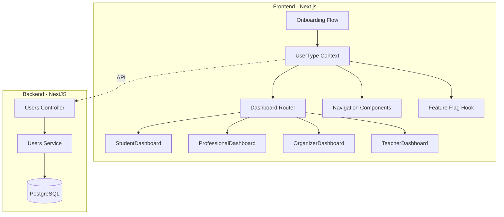
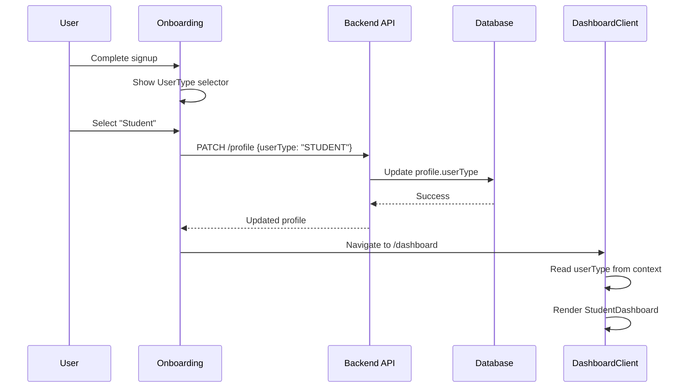

# Design Document: Role-Based UX Launch

## Overview

This design document outlines the technical implementation for transforming LINKER into a focused "Events OS for Students & Organizers" through UX personalization. The system introduces a `userType` field that determines dashboard layout, feature visibility, and navigation structure—completely separate from the existing RBAC permission system.

The key architectural principle is **separation of concerns**: `userType` controls UX/presentation while `role` controls permissions/access. This allows a STUDENT userType to still have CLUB_ADMIN permissions, or an ORGANIZER userType to have STUDENT permissions.

## Architecture

### High-Level Architecture



### Data Flow



## Components and Interfaces

### 1. UserType Enum and Types

```typescript
// apps/web/lib/userTypes.ts

export enum UserType {
  STUDENT = 'STUDENT',
  PROFESSIONAL = 'PROFESSIONAL',
  ORGANIZER = 'ORGANIZER',
  TEACHER = 'TEACHER',
}

export interface UserTypeConfig {
  type: UserType;
  icon: string;
  label: string;
  description: string;
  dashboardComponent: string;
  defaultEventsTab: string;
  showFAB: boolean;
  enabledFeatures: string[];
}

export const USER_TYPE_CONFIGS: Record<UserType, UserTypeConfig> = {
  [UserType.STUDENT]: {
    type: UserType.STUDENT,
    icon: '🎓',
    label: 'Student',
    description: 'Discover and attend campus events',
    dashboardComponent: 'StudentDashboard',
    defaultEventsTab: 'campus',
    showFAB: false,
    enabledFeatures: ['eventsView', 'rsvp', 'qrCheckin', 'certificates', 'chat'],
  },
  [UserType.PROFESSIONAL]: {
    type: UserType.PROFESSIONAL,
    icon: '🧑‍💼',
    label: 'Working Professional',
    description: 'Attend events and network globally',
    dashboardComponent: 'ProfessionalDashboard',
    defaultEventsTab: 'all',
    showFAB: false,
    enabledFeatures: ['eventsView', 'rsvp', 'qrCheckin', 'certificates', 'chat'],
  },
  [UserType.ORGANIZER]: {
    type: UserType.ORGANIZER,
    icon: '🎤',
    label: 'I want to host events',
    description: 'Create and manage campus or public events',
    dashboardComponent: 'OrganizerDashboard',
    defaultEventsTab: 'myEvents',
    showFAB: true,
    enabledFeatures: ['eventsView', 'eventsCreate', 'rsvp', 'qrCheckin', 'certificates', 'chat', 'analytics'],
  },
  [UserType.TEACHER]: {
    type: UserType.TEACHER,
    icon: '👨‍🏫',
    label: 'Teacher / Faculty',
    description: 'Manage classrooms and verify attendance',
    dashboardComponent: 'TeacherDashboard',
    defaultEventsTab: 'verified',
    showFAB: false,
    enabledFeatures: ['eventsView', 'rsvp', 'qrCheckin', 'certificates', 'chat', 'classroom'],
  },
};
```

### 2. UserType Context

```typescript
// apps/web/app/context/UserTypeContext.tsx

interface UserTypeContextType {
  userType: UserType | null;
  config: UserTypeConfig | null;
  isLoading: boolean;
  setUserType: (type: UserType) => Promise<void>;
  isFeatureEnabled: (feature: string) => boolean;
}
```

### 3. Dashboard Router Component

```typescript
// apps/web/app/dashboard/DashboardRouter.tsx

interface DashboardRouterProps {
  userType: UserType;
}

// Routes to appropriate dashboard based on userType
// Returns: StudentDashboard | ProfessionalDashboard | OrganizerDashboard | TeacherDashboard
```

### 4. Navigation Components

```typescript
// Desktop Navigation - 4 items
interface DesktopNavItem {
  href: string;
  label: string;
  icon: ReactNode;
  isActive: boolean;
}

const DESKTOP_NAV_ITEMS: DesktopNavItem[] = [
  { href: '/dashboard', label: 'Dashboard', icon: <Home />, isActive: false },
  { href: '/events', label: 'Events', icon: <Calendar />, isActive: false },
  { href: '/messages', label: 'Messages', icon: <MessageSquare />, isActive: false },
  { href: '/profile', label: 'Profile', icon: <User />, isActive: false },
];

// Mobile Navigation - 4 items + conditional FAB
interface MobileNavConfig {
  items: DesktopNavItem[];
  showFAB: boolean;
  fabAction: () => void;
}
```

### 5. Feature Flag Integration

```typescript
// apps/web/lib/featureFlags.ts (extended)

export interface FeatureFlagsV2 extends FeatureFlags {
  // User type specific flags
  feedComposer: boolean;
  socialFeed: boolean;
  eventCreation: boolean;
  marketplaceWrite: boolean;
  notesWrite: boolean;
}

export function isFeatureEnabledForUserType(
  feature: keyof FeatureFlagsV2,
  userType: UserType | null,
  permissionRole?: string
): boolean;
```

### 6. Dashboard Components Interface

```typescript
// Common props for all dashboard components
interface DashboardProps {
  user: User;
  userType: UserType;
}

// StudentDashboard sections
interface StudentDashboardSections {
  upcomingEvents: Event[];
  campusEvents: Event[];
  recommendedEvents: Event[];
}

// OrganizerDashboard sections
interface OrganizerDashboardSections {
  myEvents: OrganizerEventCard[];
  quickActions: QuickAction[];
}

interface OrganizerEventCard {
  event: Event;
  registrations: number;
  attendancePercentage: number;
  revenue: number | null;
  status: 'DRAFT' | 'LIVE' | 'ENDED';
}
```

## Data Models

### Backend Schema Changes

```prisma
// prisma/schema.prisma

enum UserType {
  STUDENT
  PROFESSIONAL
  ORGANIZER
  TEACHER
}

model Profile {
  id            String    @id @default(cuid())
  userId        String    @unique
  user          User      @relation(fields: [userId], references: [id])
  
  // Existing fields...
  fullName      String?
  bio           String?
  avatarUrl     String?
  collegeId     String?
  
  // NEW: UX personalization field (separate from role)
  userType      UserType? @default(STUDENT)
  
  // Existing fields...
  isOnboarded   Boolean   @default(false)
  onboardingStep Int?
  
  createdAt     DateTime  @default(now())
  updatedAt     DateTime  @updatedAt
}
```

### API Endpoints

```typescript
// PATCH /api/profile
interface UpdateProfileDto {
  // Existing fields...
  fullName?: string;
  bio?: string;
  avatarUrl?: string;
  
  // NEW
  userType?: UserType;
}

// GET /api/profile response includes userType
interface ProfileResponse {
  id: string;
  fullName: string | null;
  userType: UserType | null;
  // ... other fields
}
```

### Frontend State Shape

```typescript
// User object in AuthContext
interface User {
  id: string;
  email: string;
  role: UserRole; // Permission role (STUDENT, CLUB_ADMIN, etc.)
  profile: {
    id: string;
    fullName: string | null;
    userType: UserType | null; // UX personalization
    collegeId: string | null;
    isOnboarded: boolean;
    // ... other fields
  };
}
```

## Correctness Properties

*A property is a characteristic or behavior that should hold true across all valid executions of a system—essentially, a formal statement about what the system should do. Properties serve as the bridge between human-readable specifications and machine-verifiable correctness guarantees.*


Based on the prework analysis, the following properties have been identified and consolidated to eliminate redundancy:

### Property 1: UserType-Role Independence

*For any* user, changing the userType field SHALL NOT affect the permission role field, and changing the permission role SHALL NOT affect the userType field. The two fields must remain completely independent.

**Validates: Requirements 1.4, 12.3, 12.4, 17.5**

### Property 2: Dashboard Routing Correctness

*For any* valid userType value (STUDENT, PROFESSIONAL, ORGANIZER, TEACHER), accessing the dashboard SHALL render the corresponding dashboard component (StudentDashboard, ProfessionalDashboard, OrganizerDashboard, TeacherDashboard respectively).

**Validates: Requirements 3.1, 3.2, 3.3, 3.4, 8.3, 14.5**

### Property 3: UserType Persistence Round-Trip

*For any* valid userType value, setting the userType via the API and then retrieving the user profile SHALL return the same userType value that was set.

**Validates: Requirements 1.3, 2.3, 16.3**

### Property 4: Feature Flag UserType Gating

*For any* userType and feature combination, the isFeatureEnabledForUserType function SHALL return the correct enabled/disabled state according to the USER_TYPE_CONFIGS mapping. Specifically:
- eventsCreate: true only for ORGANIZER
- feedComposer: false for STUDENT and PROFESSIONAL
- communities: false for all userTypes
- collaboration: false for all userTypes

**Validates: Requirements 10.1, 10.2, 10.3, 10.4, 10.5, 10.6, 10.7, 15.2, 15.3**

### Property 5: Events Page Tab Configuration

*For any* userType, the Events page SHALL display the correct tab configuration:
- STUDENT: [Campus, Open Events, My RSVPs]
- PROFESSIONAL: [All Events, My RSVPs]
- ORGANIZER: [My Events, All Events]
- TEACHER: [Verified Events, Campus Events, My RSVPs]

And the default selected tab SHALL be the first tab in each configuration.

**Validates: Requirements 11.1, 11.2, 11.3, 11.4, 11.5**

### Property 6: FAB Visibility by UserType

*For any* userType, the mobile Floating Action Button SHALL be visible if and only if userType equals ORGANIZER.

**Validates: Requirements 9.2, 9.3**

### Property 7: Feed Feature Hiding

*For any* user with userType STUDENT or PROFESSIONAL, the FeedComposer component and social feed posts SHALL NOT be rendered on the dashboard.

**Validates: Requirements 4.2, 4.3, 5.3**

### Property 8: Event Card Display Modes

*For any* Event_Card component, when rendered in "attendee" mode it SHALL display RSVP, Save, Share, View Details actions, and when rendered in "organizer" mode it SHALL display Registrations, Attendance %, Revenue, Status fields.

**Validates: Requirements 19.2, 19.3, 19.4**

### Property 9: Campus Events Conditional Display

*For any* user on the Student or Professional dashboard, the Campus Events section SHALL be visible if and only if the user has a non-null collegeId.

**Validates: Requirements 4.6, 4.7**

### Property 10: Navigation State Consistency

*For any* userType change, the system SHALL clear cached dashboard state and subsequent dashboard access SHALL render the new userType's dashboard without stale data.

**Validates: Requirements 20.1, 20.2, 20.3, 20.4**

### Property 11: Organizer Events Sort Order

*For any* list of events displayed on the Organizer Dashboard, the events SHALL be sorted by status in the order: LIVE first, then DRAFT, then ENDED.

**Validates: Requirements 6.5**

### Property 12: Settings UserType Options

*For any* current userType value, the Settings page SHALL allow changing to any of the four valid userType values (STUDENT, PROFESSIONAL, ORGANIZER, TEACHER).

**Validates: Requirements 2.2, 2.4**

## Error Handling

### User Type Not Set

When a user accesses the dashboard without a userType set:
1. Check if `user.profile.userType` is null/undefined
2. Redirect to `/onboarding?step=usertype` 
3. Display the User Type Selector
4. After selection, redirect to the appropriate dashboard

```typescript
// In DashboardClient.tsx
if (!user.profile?.userType) {
  router.replace('/onboarding?step=usertype');
  return <LoadingState />;
}
```

### Invalid User Type Value

If an invalid userType value is received from the API:
1. Log the error for monitoring
2. Default to STUDENT userType for UX continuity
3. Display a toast notification suggesting the user update their settings

```typescript
function validateUserType(value: string | null): UserType {
  if (value && Object.values(UserType).includes(value as UserType)) {
    return value as UserType;
  }
  console.error(`Invalid userType: ${value}, defaulting to STUDENT`);
  return UserType.STUDENT;
}
```

### API Failure During UserType Update

When the API fails to update userType:
1. Display error toast: "Failed to update user type. Please try again."
2. Revert the UI to the previous userType
3. Log the error with context for debugging

### Feature Flag Fallback

When feature flag checks fail:
1. Default to the most restrictive setting (feature disabled)
2. Log the error for monitoring
3. Continue rendering without the feature

## Testing Strategy

### Dual Testing Approach

This feature requires both unit tests and property-based tests for comprehensive coverage:

**Unit Tests** - For specific examples and edge cases:
- Component rendering tests for each dashboard type
- Navigation item presence tests
- Empty state rendering tests
- Loading state tests
- Error boundary tests

**Property-Based Tests** - For universal properties:
- UserType-Role independence
- Dashboard routing correctness
- Feature flag gating
- Events page tab configuration
- FAB visibility rules

### Property-Based Testing Configuration

- **Library**: fast-check (TypeScript property-based testing)
- **Minimum iterations**: 100 per property test
- **Tag format**: `Feature: role-based-ux-launch, Property {number}: {property_text}`

### Test File Structure

```
apps/web/__tests__/
├── properties/
│   └── role-based-ux-launch.property.test.ts  # Property-based tests
├── components/
│   ├── StudentDashboard.test.tsx
│   ├── OrganizerDashboard.test.tsx
│   ├── TeacherDashboard.test.tsx
│   ├── ProfessionalDashboard.test.tsx
│   ├── UserTypeSelector.test.tsx
│   └── BottomNav.test.tsx
└── hooks/
    └── useUserType.test.ts
```

### Key Test Scenarios

1. **Dashboard Routing**: Generate random userType values, verify correct dashboard renders
2. **Feature Flags**: Generate userType + feature combinations, verify correct enabled state
3. **Independence**: Generate random role + userType combinations, verify no cross-contamination
4. **Tab Configuration**: Generate userType values, verify correct tabs array
5. **FAB Visibility**: Generate userType values, verify FAB shows only for ORGANIZER

### Integration Test Points

- Onboarding flow with userType selection
- Settings page userType change
- Dashboard navigation after userType change
- Feature visibility across different userTypes
